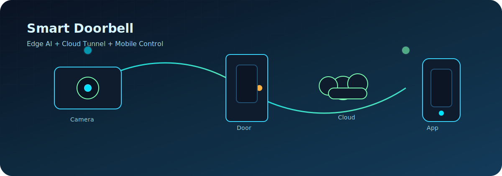
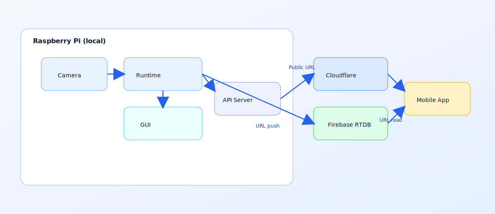
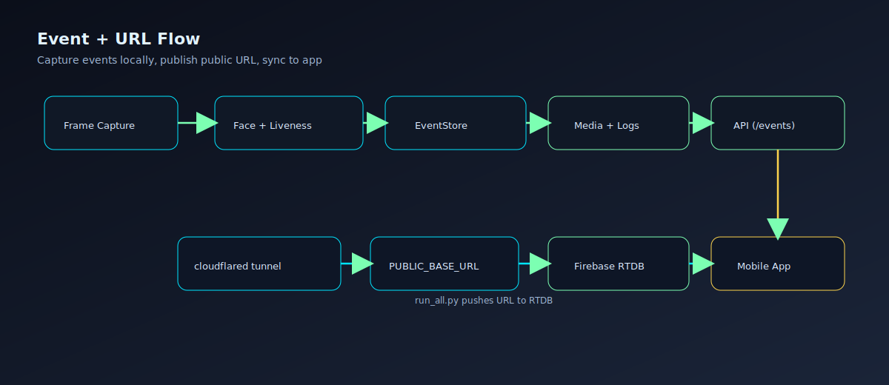

# 🚪 Pi5 Smart Doorbell

Hệ thống chuông cửa thông minh chạy trên Raspberry Pi 5: nhận diện khuôn mặt, điều khiển cửa, lưu sự kiện, và cung cấp API cho app điện thoại.

## ✨ Điểm nổi bật
- 📷 Live camera + nhận diện khuôn mặt (InsightFace mặc định).
- 🧠 ROI + liveness (tùy chọn) để giảm nhận nhầm.
- 🔒 Điều khiển cửa/LED/LCD qua GPIO.
- 🌐 FastAPI cho mobile app (events, lock/unlock).
- 🚀 Cloudflare tunnel + tự cập nhật URL lên Firebase RTDB.

## Visual Overview
Quick visuals for system, architecture, and data flow.







## ✅ Yêu cầu cơ bản
- Raspberry Pi 5 + camera (hoặc webcam USB).
- Python 3.9+ (khuyến nghị 3.11).
- Nếu dùng Pi camera: bật camera trong `raspi-config`.
- (Tuỳ chọn) `cloudflared` nếu muốn tunnel.

## 🧱 Cài đặt trên máy mới (bắt buộc)
### 1) Clone code
```bash
git clone git@github.com:Tunglam0605/TungLamvsSmartDoorbell.git
cd TungLamvsSmartDoorbell
```

### 2) Tạo môi trường ảo + cài package
```bash
python -m venv .venv
source .venv/bin/activate
pip install -r requirements.txt
```

### 3) Cài models (bắt buộc)
Models **không được đưa vào Git** (đã bỏ qua `models/`). Sau khi clone, bạn cần tự tải/copy vào thư mục `models/`.

```bash
mkdir -p models
```

**Các file cần có:**
- `scrfd_10g_bnkps.onnx` (InsightFace detector)
- `w600k_r50.onnx` (InsightFace recognizer)
- `MobileNet-v2_float.tflite` (fallback TFLite, chỉ cần nếu dùng `DOORBELL_FACE_BACKEND=tflite` hoặc tắt strict)
- `modelrgb.onnx` (liveness, chỉ cần nếu bật `GUI_ENABLE_LIVENESS`)

**Tải InsightFace model tự động (tuỳ chọn):**
```bash
python - <<'PY'
from insightface.model_zoo import get_model
get_model("scrfd_10g_bnkps", download=True)
get_model("w600k_r50", download=True)
print("Downloaded to ~/.insightface/models")
PY
cp ~/.insightface/models/scrfd_10g_bnkps.onnx models/
cp ~/.insightface/models/w600k_r50.onnx models/
```

## ▶️ Chạy hệ thống
### Cách 1: chạy đầy đủ (GUI + API + Tunnel)
```bash
./.venv/bin/python run_all.py
```
Hoặc:
```bash
source .venv/bin/activate
python run_all.py
```

### Cách 2: chỉ chạy GUI (không API, không tunnel)
```bash
python run_gui.py
```

### Tự chạy khi khởi động (systemd user service)
Hiện **đang tắt** để tránh lỗi khi chưa có màn hình đăng nhập.
Nếu cần bật lại, dùng phần hướng dẫn trong lịch sử chỉnh sửa hoặc yêu cầu mình thêm lại.

## 🌐 API cho mobile app
**Base URL:** `http://<API_HOST>:<API_PORT>` hoặc URL tunnel `https://<id>.trycloudflare.com`

### GET `/health`
```json
{ "ok": true }
```

### GET `/events`
Trả về danh sách event mới nhất (tối đa `EVENT_MAX_ITEMS`).

```json
[
  {
    "eventId": "evt_001",
    "timestamp": "2025-12-31 06:10:34",
    "type": "UNKNOWN",
    "imageUrl": "https://<public>/media/evt_001_20251231_061034.jpg",
    "personName": null
  },
  {
    "eventId": "evt_002",
    "timestamp": "2025-12-31 06:10:40",
    "type": "KNOWN",
    "imageUrl": "https://<public>/media/evt_002_20251231_061040.jpg",
    "personName": "Anh Tuan"
  }
]
```

### POST `/unlock` / `/lock`
```json
{ "eventId": "evt_002", "source": "app" }
```

### POST `/events/clear`
Xoá toàn bộ event trên Pi5 (RAM + ảnh + log).
```json
{ "removeMedia": true, "removeLog": true }
```
Nếu không gửi body, mặc định vẫn xoá cả ảnh và log.

## ⚙️ Biến môi trường quan trọng
- `API_HOST`, `API_PORT`
- `DOORBELL_TUNNEL_ENABLE` (0 để tắt tunnel)
- `DOORBELL_TUNNEL_CMD`, `DOORBELL_TUNNEL_TARGET`
- `PUBLIC_BASE_URL`, `DOORBELL_TUNNEL_URL`
- `DOORBELL_FACE_BACKEND` (`insightface` | `tflite`)
- `DOORBELL_FACE_STRICT` (1 = bắt buộc InsightFace)
- `DOORBELL_INSIGHTFACE_DET_SIZE` (mặc định 640)
- `DOORBELL_DOOR_CLOSE_DELAY_SEC` (thời gian tự đóng cửa khi mất mặt)
- `DOORBELL_FIREBASE_URL`, `DOORBELL_FIREBASE_KEY`, `DOORBELL_FIREBASE_AUTH`, `DOORBELL_FIREBASE_ENABLE`

## Hướng dẫn chuyển Cloudflare/Firebase về tài khoản của bạn
Phần này dành cho người mới: tạo tài nguyên mới trong tài khoản của bạn và cập nhật biến môi trường để hệ thống dùng đúng Cloudflare/Firebase của bạn.

### A) Cloudflare Tunnel (URL public)
1) Tạo/đăng nhập Cloudflare, thêm domain (zone) của bạn.
2) Cài `cloudflared` trên máy chạy dự án.
3) Đăng nhập `cloudflared`:
   ```bash
   cloudflared tunnel login
   ```
4) Tạo tunnel:
   ```bash
   cloudflared tunnel create doorbell
   ```
5) Tạo DNS route (đặt subdomain theo ý bạn):
   ```bash
   cloudflared tunnel route dns doorbell doorbell.<ten-domain-cua-ban>
   ```
6) Tạo file cấu hình `cloudflared` (ví dụ `cloudflared/config.yml`):
   ```yml
   tunnel: doorbell
   credentials-file: <duong-dan-toi-file-credentials>.json
   ingress:
     - hostname: doorbell.<ten-domain-cua-ban>
       service: http://127.0.0.1:8000
     - service: http_status:404
   ```
7) Cập nhật biến môi trường khi chạy app:
   - `DOORBELL_TUNNEL_CMD=cloudflared tunnel --config <duong-dan-config.yml> run doorbell`
   - `PUBLIC_BASE_URL=https://doorbell.<ten-domain-cua-ban>`
   - (tuỳ chọn) `DOORBELL_TUNNEL_ENABLE=1`

Lưu ý:
- Nếu bạn chỉ dùng URL tạm `trycloudflare` (không cần tài khoản), giữ mặc định `DOORBELL_TUNNEL_CMD` và không cần cấu hình DNS.
- Với tunnel gắn domain riêng, hãy set `PUBLIC_BASE_URL` thủ công vì code chỉ tự nhận URL dạng `*.trycloudflare.com`.

### B) Firebase Realtime Database (để app/mobile đọc URL)
1) Tạo Firebase project trong tài khoản của bạn.
2) Mở **Realtime Database** → **Create Database** → chọn region.
3) Thiết lập Rules:
   - Thử nghiệm nhanh: bật `.read`/`.write` = `true`.
   - Sản xuất: yêu cầu auth và dùng `DOORBELL_FIREBASE_AUTH`.
4) Lấy Database URL dạng `https://<project>-default-rtdb.firebaseio.com/`.
5) Chọn key/path để lưu URL (ví dụ `doorbell/public_url`).
6) (Nếu cần auth) lấy **Database Secret** hoặc token hợp lệ.
7) Cập nhật biến môi trường:
   - `DOORBELL_FIREBASE_URL`
   - `DOORBELL_FIREBASE_KEY`
   - `DOORBELL_FIREBASE_AUTH` (nếu rules yêu cầu)
   - `DOORBELL_FIREBASE_ENABLE=1`

Sau khi chạy `run_all.py`, URL public sẽ được ghi vào `<DOORBELL_FIREBASE_KEY>.json` trong RTDB.

### C) Chỉnh ở đâu (file/biến nào)
- `config.py`: giá trị mặc định cho `PUBLIC_BASE_URL`, `FIREBASE_RTDB_URL`, `FIREBASE_RTDB_KEY`, `FIREBASE_RTDB_AUTH`, `FIREBASE_RTDB_ENABLE`. Nếu bạn không muốn set env, có thể sửa trực tiếp ở đây.
- `run_all.py`: 
  - `_start_tunnel()` dùng `DOORBELL_TUNNEL_CMD` và `DOORBELL_TUNNEL_TARGET` để chạy `cloudflared`.
  - `_announce_tunnel_url()` cập nhật `PUBLIC_BASE_URL`/`DOORBELL_TUNNEL_URL` khi tunnel sẵn sàng.
  - `_push_firebase_url()` gửi URL lên Firebase RTDB (PUT JSON).
- `server/app.py`: định nghĩa API `/health`, `/events`, `/unlock`, `/lock`, `/events/clear` và định dạng request/response.
- `server/event_store.py`: định dạng event, nơi tạo `imageUrl` từ `PUBLIC_BASE_URL`, và ghi log `logs/events.jsonl`.
- `PROJECT_DOC.md`: bảng cấu hình và kiến trúc tổng quan.

### D) Luồng giao tiếp & định dạng dữ liệu (Pi ↔ Server ↔ Firebase)
#### 1) Luồng khởi động (run_all.py)
```
Pi (run_all.py)
  ├─ start FastAPI (server/app.py)
  ├─ start cloudflared tunnel (nếu bật)
  ├─ đọc URL public (trycloudflare hoặc domain riêng)
  └─ PUT URL lên Firebase RTDB (nếu enable)
```
`PUBLIC_BASE_URL` được dùng để tạo `imageUrl` khi lưu event. Nếu URL sai, app sẽ không xem được ảnh `/media/...`.

#### 2) Luồng Cloudflare Tunnel
- `cloudflared` tạo URL public hoặc domain riêng và reverse proxy về `http://API_HOST:API_PORT`.
- Nếu dùng domain riêng, bạn **phải set** `PUBLIC_BASE_URL=https://<domain>` vì code chỉ tự nhận URL dạng `*.trycloudflare.com`.

#### 3) Luồng Firebase RTDB (gửi URL public)
`run_all.py` gửi request:
```
PUT {DOORBELL_FIREBASE_URL}/{DOORBELL_FIREBASE_KEY}.json?auth={DOORBELL_FIREBASE_AUTH}
Content-Type: application/json
Body: "https://doorbell.<ten-domain-cua-ban>"
```
Lưu ý:
- `DOORBELL_FIREBASE_KEY` có thể là path dạng `doorbell/public_url` (RTDB cho phép dấu `/`).
- Giá trị lưu là **chuỗi JSON** (string), không phải object.

#### 4) Luồng API (app/mobile ↔ Pi)
Base URL = `PUBLIC_BASE_URL` (hoặc `DOORBELL_TUNNEL_URL` nếu set thủ công).

**GET `/health`**
```json
{ "ok": true }
```

**GET `/events`** (trả danh sách mới nhất trong RAM, max `EVENT_MAX_ITEMS`)
```json
[
  {
    "eventId": "evt_abcdef12",
    "timestamp": "2025-12-31 06:10:34",
    "type": "KNOWN",
    "imageUrl": "https://<public>/media/evt_abcdef12_20251231_061034.jpg",
    "personName": "Anh Tuan"
  }
]
```
Lưu ý: API response chỉ trả các field theo `server/app.py` (không gồm `source`/`meta`).

**POST `/unlock`**
```json
{ "eventId": "evt_abcdef12", "source": "app" }
```
Response:
```json
{
  "ok": true,
  "eventId": "evt_abcdef12",
  "message": "door opened",
  "lightOk": true,
  "timestamp": "2025-12-31T06:10:40.123Z"
}
```

**POST `/lock`**
```json
{ "eventId": "evt_abcdef12", "source": "app" }
```
Response tương tự `/unlock` với `message` = `door closed`.

**POST `/events/clear`**
```json
{ "removeMedia": true, "removeLog": true }
```
Response:
```json
{ "ok": true, "removedMedia": 12, "removedLog": true }
```

#### 5) Định dạng event lưu log (logs/events.jsonl)
Mỗi dòng là JSON:
```json
{
  "eventId": "evt_abcdef12",
  "timestamp": "2025-12-31 06:10:34",
  "type": "KNOWN",
  "imageUrl": "https://<public>/media/evt_abcdef12_20251231_061034.jpg",
  "personName": "Anh Tuan",
  "source": "gui",
  "meta": {}
}
```
Với hành động API `/unlock`/`/lock`, `type` lần lượt là `UNLOCK`/`LOCK` và `meta` có `ok`, `message`, `requestEventId`.

## 🧠 Cách hoạt động (tóm tắt sâu)
1) Camera đọc frame → nhận diện khuôn mặt (detector + embedding).
2) So khớp embedding với DB (`face/known_faces/face_db.json`).
3) Nếu bật liveness, kiểm tra thật/giả trước khi mở cửa.
4) GUI hiển thị trạng thái, door control và lưu event.
5) FastAPI phục vụ app, trả event mới nhất và điều khiển cửa.

## 📁 Dữ liệu & thư mục
- `media/`: ảnh sự kiện
- `logs/events.jsonl`: log JSONL
- `face/known_faces/face_db.json`: DB người quen

## 🛠️ Lỗi thường gặp
- **Thiếu model**: báo `FileNotFoundError` → kiểm tra `models/`.
- **Không có cloudflared**: đặt `DOORBELL_TUNNEL_ENABLE=0`.
- **Không mở được GUI**: cần màn hình/VNC hoặc cấu hình X11.
- **Lỗi SciPy trên Pi**: cài nhanh `sudo apt install -y python3-scipy`.
- **Picamera2 không chạy**: cài `python3-picamera2` và bật camera trong `raspi-config`.

## 📚 Tài liệu chi tiết
- Xem `PROJECT_DOC.md` để hiểu kiến trúc và luồng xử lý sâu hơn.
- Thư mục `face/` và `utils/` có README riêng.
